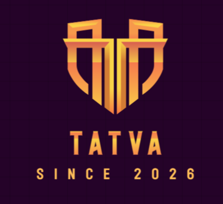
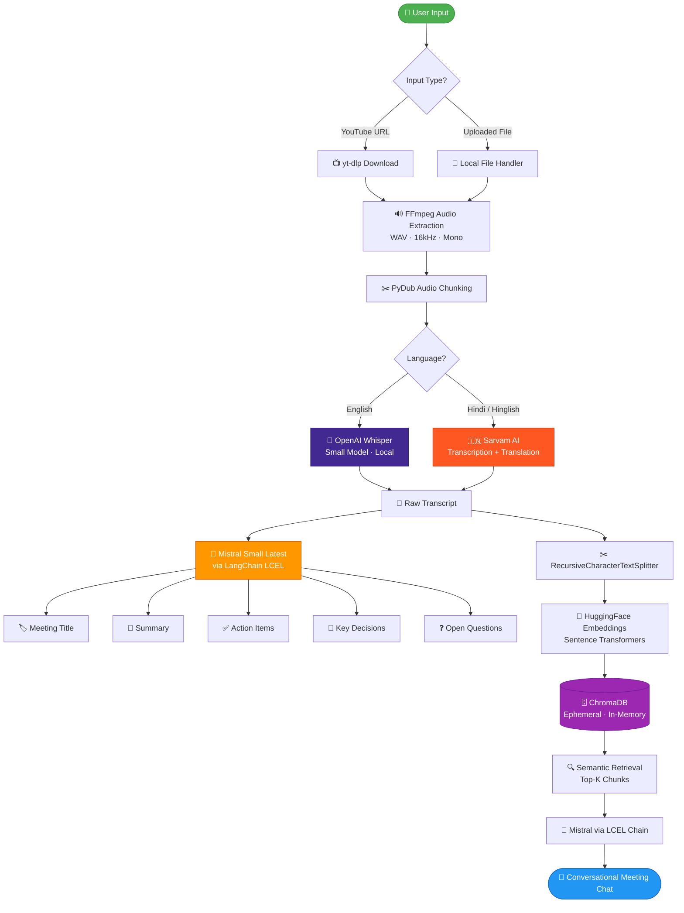

<div align="center">



# TatvaAI

### AI-Powered Meeting Intelligence Assistant

**Transform unstructured meeting recordings into searchable, structured organizational knowledge.**

[](https://www.python.org/)
[](https://streamlit.io/)
[](https://www.langchain.com/)
[](https://mistral.ai/)
[](https://www.trychroma.com/)
[](https://openai.com/research/whisper)
[](LICENSE)
[](https://github.com/Gauranga025/TatvaAI)

---

> *"What if every meeting you ever attended could be recalled, searched, and understood in seconds?"*

**[🔴 Live Demo](https://tatvaai-gauranga025.streamlit.app/)** · **[⚙️ Installation](#️-installation)** · **[🏗️ Architecture](#️-system-architecture)** · **[📸 Screenshots](#-screenshots)**

</div>

---

## 📌 Table of Contents

- [Overview](#-overview)
- [Live Demo](#-live-demo)
- [Features](#-features)
- [Tech Stack](#️-tech-stack)
- [System Architecture](#️-system-architecture)
- [Project Workflow](#-project-workflow)
- [Folder Structure](#-folder-structure)
- [Installation](#️-installation)
- [Environment Variables](#-environment-variables)
- [Usage](#-usage)
- [AI Pipeline Deep Dive](#-ai-pipeline-deep-dive)
- [Challenges Solved](#-challenges-solved)
- [Future Improvements](#-future-improvements)
- [Screenshots](#-screenshots)
- [Deployment](#-deployment)
- [Contributing](#-contributing)
- [License](#-license)

---

## 🌟 Overview

Modern organizations lose thousands of hours annually to meetings that produce no searchable, structured record. Notes are incomplete, decisions are forgotten, and action items scatter across chat threads. **TatvaAI** solves this by applying state-of-the-art AI to any meeting recording or YouTube video.

Given a YouTube URL or an uploaded audio/video file, TatvaAI delivers a complete intelligence layer over the spoken content:

- 🎙️ **Transcribes** recordings with high accuracy — English, Hindi, and Hinglish
- 📝 **Summarizes** the meeting into a concise, readable brief
- ✅ **Extracts action items** with clear ownership signals
- 🔑 **Identifies key decisions** made during the meeting
- ❓ **Surfaces open questions** left unresolved
- 💬 **Enables conversational Q&A** grounded in the actual transcript via a RAG pipeline

**Target users:** Product and engineering teams, remote-first organizations, researchers, students, and anyone who needs to extract structured knowledge from long-form spoken content.

---

## 🔴 Live Demo

> Try TatvaAI live — no setup required.

[](https://tatvaai-gauranga025.streamlit.app/)

**👉 [https://tatvaai-gauranga025.streamlit.app/](https://tatvaai-gauranga025.streamlit.app/)**

**Demo video used:** [Without This, Krishna Remains Hidden](https://www.youtube.com/watch?v=a3B0IRfQyw8) — All screenshots and RAG responses in this README are generated from this video.

---

## ✨ Features

| # | Feature | Description | Status |
|---|---------|-------------|--------|
| 1 | 🎙️ **Meeting Transcription** | Accurate speech-to-text from video/audio using Whisper (local inference) | ✅ Live |
| 2 | 🇮🇳 **Hindi / Hinglish Support** | Sarvam AI for Indian language transcription + direct English translation | ✅ Live |
| 3 | 🤖 **AI Summarization** | Concise meeting summaries generated by Mistral Small Latest | ✅ Live |
| 4 | ✅ **Action Item Extraction** | Automatically surfaces tasks and ownership signals from discussion | ✅ Live |
| 5 | 🔑 **Decision Tracking** | Identifies and logs key decisions made in the meeting | ✅ Live |
| 6 | ❓ **Open Question Identification** | Flags unresolved questions for follow-up | ✅ Live |
| 7 | 💬 **RAG-Based Chat** | Conversational Q&A over the transcript via ChromaDB + Mistral | ✅ Live |
| 8 | 📺 **YouTube Video Analysis** | Paste any YouTube URL and process it instantly via yt-dlp | ✅ Live |
| 9 | 📂 **Local File Upload** | Upload MP4, MKV, WAV, MP3, M4A, OGG, FLAC, WebM, MOV files | ✅ Live |
| 10 | 🏷️ **Meeting Title Generation** | Auto-generates a descriptive title from the transcript content | ✅ Live |
| 11 | 📊 **Streamlit Dashboard** | Clean, tabbed, single-page web UI with real-time progress tracking | ✅ Live |
| 12 | 🔒 **Session-Isolated Processing** | Per-user ephemeral ChromaDB + temp directories; no cross-user data leaks | ✅ Live |
| 13 | ⚡ **Singleton Model Loading** | Whisper and embedding models cached once via `@st.cache_resource` | ✅ Live |

---

## 🛠️ Tech Stack

| Category | Technologies |
|----------|-------------|
| **Core Language** | Python 3.10+ |
| **Frontend / UI** | Streamlit 1.35+, custom CSS (Inter font, CSS variables) |
| **Speech-to-Text (English)** | OpenAI Whisper (Small model, local inference) |
| **Speech-to-Text (Hindi/Hinglish)** | Sarvam AI Transcription + Translation API |
| **LLM** | Mistral Small Latest (summarization, extraction, title generation, RAG Q&A) |
| **LLM Framework** | LangChain LCEL (chains, prompt templates, retrievers) |
| **Vector Database** | ChromaDB (ephemeral, in-memory, per-session) |
| **Embeddings** | HuggingFace Sentence Transformers |
| **Audio Processing** | PyDub (chunking), FFmpeg (format conversion), ffmpeg-python |
| **Video Acquisition** | yt-dlp (YouTube download) |
| **Translation (utility)** | deep-translator |
| **Deployment** | Streamlit Community Cloud, packages.txt for system deps |

---

## 🏗️ System Architecture

TatvaAI is structured as a **modular, sequential AI pipeline** where each stage has a single responsibility and clean inputs/outputs. The Streamlit frontend orchestrates these modules with real-time progress tracking.



---

## 🔬 Project Workflow

### Data Flow Overview

```
Input (URL / File)
    │
    ▼
Audio Acquisition (yt-dlp / file handler)
    │
    ▼
Format Normalization (FFmpeg → WAV, 16kHz, mono)
    │
    ▼
Chunking (PyDub → N-second segments)
    │
    ▼
Transcription (Whisper local / Sarvam AI API)
    │
    ▼
Transcript Assembly (chunk concatenation)
    │
    ├─→ LLM Intelligence Extraction (Mistral via LangChain LCEL)
    │       ├── Title Generation
    │       ├── Summary
    │       ├── Action Items
    │       ├── Key Decisions
    │       └── Open Questions
    │
    └─→ RAG Index Construction (ChromaDB · ephemeral)
            └── Conversational Q&A (Mistral + retrieval)
```

**Intermediate outputs** at each stage are passed as Python objects in session state — no intermediate files are persisted beyond the analysis run. All temporary audio/WAV/chunk files are deleted in a `finally` block immediately after transcription completes, keeping disk usage minimal even on constrained cloud runners.

**Final outputs** are stored in `st.session_state.result` as a dictionary: `title`, `transcript`, `summary`, `action_items`, `key_decisions`, `open_questions`, and a live `rag_chain` object ready for Q&A.

---

## 📁 Folder Structure

```text
TatvaAI/
│
├── app.py                        # Main Streamlit application (792 lines)
│                                 # Handles: UI, routing, session state, pipeline
│                                 # orchestration, error handling, chat interface
│
├── main.py                       # CLI/standalone entry point
├── test.py                       # Testing utilities
│
├── requirements.txt              # Python dependencies (pinned versions)
├── packages.txt                  # System-level packages for Streamlit Cloud
│                                 # (declares ffmpeg for cloud runners)
│
├── assets/
│   └── TatvaAI.png               # Application logo and branding
│   └── TP1.png                   # Screenshot: Action items output
│   └── TP2.png                   # Screenshot: Summary output
│   └── TP3.png                   # Screenshot: RAG chat interface
│   └── TP4.png                   # Screenshot: Dashboard overview
│
├── core/
│   ├── transcriber.py            # Transcription logic
│   │                             # Whisper (English) + Sarvam AI (Hindi/Hinglish)
│   │                             # Includes _get_whisper_model() for cache_resource
│   │
│   ├── summarizer.py             # Summary + title generation
│   │                             # Mistral Small Latest via LangChain LCEL chains
│   │
│   ├── extractor.py              # Structured extraction module
│   │                             # extract_action_items(), extract_key_decisions(),
│   │                             # extract_questions() — each a separate LCEL chain
│   │
│   ├── mistral_client.py         # Mistral API client wrapper
│   │                             # MistralAuthError, classify_api_error()
│   │                             # Key resolution: st.secrets → os.environ
│   │
│   ├── rag_engine.py             # RAG pipeline
│   │                             # build_rag_chain(): ChromaDB EphemeralClient,
│   │                             # HuggingFace embeddings, LCEL retrieval chain
│   │                             # ask_question(): context-aware answer generation
│   │                             # Includes _get_embeddings() for cache_resource
│   │
│   └── vector_store.py           # ChromaDB setup and collection management
│
├── utils/
│   ├── audio_processor.py        # process_input(): yt-dlp download + FFmpeg
│   │                             # conversion + PyDub chunking
│   │                             # Returns list of WAV chunk paths
│   │
│   └── ffmpeg_validator.py       # validate_ffmpeg(), get_ffmpeg_path()
│                                 # Dynamic FFmpeg path resolution
│                                 # (shutil.which + pydub path injection)
│
└── vector_db/                    # ChromaDB persistence directory (local dev only)
                                  # Not used in cloud deployment (ephemeral client)
```

---

## ⚙️ Installation

### Prerequisites

Ensure the following are installed:

- Python 3.10+
- [FFmpeg](https://ffmpeg.org/download.html) (must be on system PATH)
- Git

### Step-by-Step Setup

**1. Clone the repository**

```bash
git clone https://github.com/Gauranga025/TatvaAI.git
cd TatvaAI
```

**2. Create and activate a virtual environment**

```bash
# Linux / macOS
python -m venv venv
source venv/bin/activate

# Windows
python -m venv venv
venv\Scripts\activate
```

**3. Install Python dependencies**

```bash
pip install -r requirements.txt
```

> ⚠️ `openai-whisper` requires `torch`. On CPU-only machines, the install may take several minutes. On first run, Whisper will download the `small` model weights (~244 MB).

**4. Verify FFmpeg is available**

```bash
ffmpeg -version
```

If FFmpeg is not found, install it:

```bash
# Ubuntu / Debian
sudo apt update && sudo apt install ffmpeg

# macOS (Homebrew)
brew install ffmpeg

# Windows — download from https://ffmpeg.org/download.html and add to PATH
```

**5. Configure environment variables**

Create a `.env` file in the project root:

```env
MISTRAL_API_KEY=your_mistral_api_key_here
SARVAM_API_KEY=your_sarvam_api_key_here
```

**6. Run the application**

```bash
streamlit run app.py
```

The app will open at **http://localhost:8501**

---

## 🔑 Environment Variables

| Variable | Required | Description | Source |
|----------|----------|-------------|--------|
| `MISTRAL_API_KEY` | ✅ Yes | Mistral AI API key for summarization, extraction, and RAG Q&A | [console.mistral.ai](https://console.mistral.ai/api-keys/) |
| `SARVAM_API_KEY` | ⚠️ Hindi only | Sarvam AI API key for Hindi/Hinglish transcription and translation | [sarvam.ai](https://www.sarvam.ai/) |

**Key resolution order (from `app.py`):**

1. `st.secrets["MISTRAL_API_KEY"]` — Streamlit Cloud secrets (production)
2. `os.environ["MISTRAL_API_KEY"]` — populated by `python-dotenv` from `.env` (local dev)

The app validates the key at startup and shows an actionable error message if it is missing, a placeholder, or shorter than 20 characters — preventing silent failures deep in the pipeline.

---

## 🚀 Usage

### Analysing a YouTube Video

1. Open the app at [https://tatvaai-gauranga025.streamlit.app/](https://tatvaai-gauranga025.streamlit.app/) or `http://localhost:8501`
2. Select **YouTube URL** as the input source
3. Paste any YouTube video URL into the input field
4. Select the language: **english** or **hinglish**
5. Click **Analyse meeting**
6. Wait for the 6-step pipeline to complete (audio → transcript → title → summary → extraction → RAG index)
7. Explore results across the five tabs: **Summary**, **Action items**, **Key decisions**, **Open questions**, **Transcript**
8. Use the **Ask about this meeting** chat interface to query the transcript conversationally

### Uploading an Audio or Video File

1. Select **Upload file** as the input source
2. Upload any supported file: `mp3`, `mp4`, `wav`, `m4a`, `ogg`, `flac`, `webm`, `mkv`, `mov`
3. Select language and click **Analyse meeting**
4. Follow the same steps as above

### Asking Questions via RAG Chat

The chat interface appears below the results tabs after analysis completes. Example queries:

```
What were the main decisions made?
Who is responsible for the follow-up on the budget?
What open questions were not resolved?
Summarize the key points about AI safety.
What did the speaker say about model capabilities?
```

Each answer is grounded in the actual transcript via semantic retrieval — the model only answers from content present in the recording.

---

## 🔬 AI Pipeline Deep Dive

### Audio Processing

The `utils/audio_processor.py` module handles all audio acquisition and preprocessing:

- **YouTube path:** `yt-dlp` downloads the best available audio stream. The module handles 403 bot-protection errors, private video errors, and rate-limit errors with specific, user-friendly messages.
- **Upload path:** The uploaded file bytes are written to a `NamedTemporaryFile` with the correct extension, and the path is stored in `st.session_state.uploaded_tmp`. The previous upload is deleted when a new file is selected.
- **Format normalization:** FFmpeg converts any input to WAV, 16kHz sample rate, mono channel — the format required by Whisper for accurate inference.
- **Path resolution:** `ffmpeg_validator.py` uses `shutil.which("ffmpeg")` for dynamic path discovery and injects the resolved path into PyDub's configuration, ensuring compatibility across local and cloud environments.

### Chunking Strategy

Long recordings are split into smaller segments using `PyDub` before transcription. This is necessary because:

- Whisper has practical limits on single-pass inference for very long audio
- Chunking enables more accurate transcription by avoiding context overflow
- Segments are processed sequentially and concatenated in order to produce the full transcript

After transcription completes, all temporary WAV chunk files are deleted from the per-run `tempfile.mkdtemp` directory inside a `finally` block, ensuring no disk bloat between sessions.

### Whisper Transcription

- **Model:** `openai-whisper` Small (local inference, no API cost, ~244 MB weights)
- **Loading:** The model is loaded once per server process via `@st.cache_resource`, preventing 244 MB reloads on every page rerun.
- **Inference:** Each audio chunk is passed to Whisper sequentially; returned text strings are concatenated with space separators to form the full transcript.

### Translation Workflow (Hindi / Hinglish)

When the user selects `hinglish`:

- Audio chunks are sent to the **Sarvam AI Transcription API** via authenticated HTTP requests
- Sarvam AI returns English-translated text natively in a single API call (transcription + translation combined)
- This is preferred over a two-step approach (transcribe → translate) because Sarvam AI is purpose-built for Indian languages, code-switched Hinglish speech, Indian proper nouns, idioms, and regional dialects

### Summarization Workflow

`core/summarizer.py` uses **LangChain LCEL** chains with **Mistral Small Latest**:

- `generate_title()`: A focused prompt asks Mistral to produce a single descriptive meeting title from the transcript
- `summarize()`: An extractive + abstractive hybrid prompt generates a multi-sentence paragraph summary

For long transcripts that exceed Mistral's context window, the pipeline handles the content in chunks and applies map-reduce summarization patterns.

### Metadata Extraction

`core/extractor.py` runs three independent LCEL chains:

- `extract_action_items()`: Role-aware structured extraction — identifies tasks and ownership signals ("John will...", "We agreed to...")
- `extract_key_decisions()`: Decisional cue detection — captures confirmed decisions ("We decided...", "It was agreed...")
- `extract_questions()`: Unresolved question identification — surfaces open questions and pending items

Each extractor returns a formatted bulleted list ready for direct display in the Streamlit UI.

### Vector Database Construction

`core/rag_engine.py` builds the RAG index using `build_rag_chain()`:

1. The full transcript is split into overlapping chunks using LangChain's `RecursiveCharacterTextSplitter`
2. Each chunk is embedded using `HuggingFace Sentence Transformers` (loaded once via `@st.cache_resource`)
3. Embeddings are stored in a `chromadb.EphemeralClient()` — in-memory, no disk persistence, no cross-user collisions
4. A unique collection name per session ensures complete isolation between concurrent users

### Retrieval-Augmented Generation

`ask_question()` in `core/rag_engine.py` implements the RAG Q&A loop:

1. The user's question is embedded using the same Sentence Transformer model
2. Semantic similarity search retrieves the top-K most relevant transcript chunks from ChromaDB
3. Retrieved chunks are injected as context into a Mistral prompt via a LangChain LCEL chain
4. Mistral generates a grounded, factual answer based only on the retrieved context

**Why RAG over direct LLM prompting?**

| Problem | RAG Solution |
|---------|-------------|
| Long transcripts exceed LLM context limits | Retrieves only relevant chunks, not the full transcript |
| LLMs hallucinate facts | Answers are grounded in actual transcript content |
| Generic summaries miss specific details | Semantic retrieval finds precise passages for specific questions |

---

## ⚡ Challenges Solved

| Challenge | Description | Resolution |
|-----------|-------------|------------|
| 🛡️ **YouTube Bot Protection** | `yt-dlp` intermittently receives 403 errors from YouTube's rate limiting and bot detection | Specific error mapping in `_friendly_error()` with actionable user messages; suggestion to upload directly as fallback |
| ☁️ **Streamlit Cloud System Packages** | Cloud environment lacked FFmpeg by default | `packages.txt` declares `ffmpeg` as a system-level dependency for the Streamlit Cloud runner |
| 🗂️ **Temporary File Lifecycle** | Uploaded files and audio chunks needed cleanup between sessions to prevent disk bloat | Per-run `tempfile.mkdtemp()` directories stored in `st.session_state`; cleaned up in a `finally` block on every exit path |
| 🔧 **FFmpeg Path Resolution** | FFmpeg binary location differs between local environments and cloud runners | `ffmpeg_validator.py` uses `shutil.which("ffmpeg")` for dynamic discovery and injects the resolved path into PyDub |
| 🗄️ **Cross-User ChromaDB Isolation** | Persistent ChromaDB could leak transcript data between concurrent users | `chromadb.EphemeralClient()` (in-memory) with unique per-session collection names — no shared state on disk |
| 📜 **Large Transcript Handling** | Mistral context window limits prevent passing full long-form transcripts in a single prompt | Map-reduce chunking patterns via LangChain; transcript splits processed sequentially |
| ⚡ **Model Reload Overhead** | Whisper (~244 MB) and Sentence Transformers reload on every Streamlit rerun | `@st.cache_resource` singletons for both models — loaded once per server process |
| 📦 **Dependency Conflicts** | LangChain, ChromaDB, and HuggingFace packages have complex version interdependencies | All critical versions pinned in `requirements.txt`; tested against Python 3.10+ |
| 🔑 **API Key Management** | Mistral key needed to work across local `.env` and Streamlit Cloud secrets without code changes | Dual-source resolution: `st.secrets` first, then `os.environ`; validated at startup with specific diagnostic messages |
| 🛑 **Silent Pipeline Failures** | Raw Python tracebacks are unhelpful and expose internals to users | `_friendly_error()` maps every known exception type to a specific, actionable user message; generic fallback for unknown errors |

---

## 🔮 Future Improvements

**Intelligence Enhancements**

- 🎤 **Speaker Diarization** — Label individual speakers throughout the transcript ("Speaker A: ...", "Speaker B: ...")
- 😊 **Sentiment Analysis** — Track meeting tone and detect tension or agreement signals
- 📊 **Meeting Analytics Dashboard** — Visualize talking time distribution, topic frequency, and decision velocity over multiple meetings
- 🕐 **Timestamped Timeline** — Auto-generate a topic flow diagram with timestamps aligned to the original recording
- 🤖 **Fine-Tuned Meeting LLM** — Domain-specific fine-tuning on meeting transcripts for higher extraction accuracy

**Language & Accessibility**

- 🌍 **Extended Indian Language Support** — Tamil, Telugu, Kannada, Bengali, Marathi via Sarvam AI
- 🔴 **Live Meeting Transcription** — Real-time transcription via microphone for ongoing meetings

**Export & Collaboration**

- 📄 **PDF Export** — One-click export of meeting summaries, action items, and decisions
- 📝 **DOCX Meeting Minutes** — Professional Word document generation for formal meeting records
- 👥 **Team Workspaces** — Shared meeting libraries with annotation and discussion threads
- ☁️ **Cloud Storage Integration** — Google Drive and Notion auto-archiving
- 🔐 **Multi-User Authentication** — Role-based access control for enterprise deployments

---

## 📸 Screenshots

### Dashboard


---

### Action Items


---

### Summary Output


---

### RAG Chat Interface


---

## 🚢 Deployment

### Streamlit Community Cloud (Recommended)

1. Fork this repository to your GitHub account
2. Go to [share.streamlit.io](https://share.streamlit.io/) and connect your GitHub repo
3. Set the main file path to `app.py`
4. Under **App Settings → Secrets**, add:
   ```toml
   MISTRAL_API_KEY = "your_mistral_api_key_here"
   SARVAM_API_KEY = "your_sarvam_api_key_here"
   ```
5. Streamlit Cloud automatically reads `packages.txt` to install FFmpeg as a system dependency
6. Click **Deploy** — the app will be live in minutes

### Docker

```dockerfile
FROM python:3.11-slim

# Install system dependencies
RUN apt-get update && apt-get install -y ffmpeg && rm -rf /var/lib/apt/lists/*

WORKDIR /app
COPY requirements.txt .
RUN pip install --no-cache-dir -r requirements.txt

COPY . .

EXPOSE 8501

CMD ["streamlit", "run", "app.py", "--server.port=8501", "--server.address=0.0.0.0"]
```

```bash
docker build -t tatvaai .
docker run -p 8501:8501 \
  -e MISTRAL_API_KEY=your_key \
  -e SARVAM_API_KEY=your_key \
  tatvaai
```

### Environment Variables for Production

When deploying outside Streamlit Cloud, ensure these are set as environment variables in your hosting platform (Railway, Render, Azure App Service, AWS ECS, etc.):

```bash
export MISTRAL_API_KEY="your_mistral_api_key_here"
export SARVAM_API_KEY="your_sarvam_api_key_here"
```

---

## 🤝 Contributing

Contributions are welcome! Please follow these steps:

1. **Fork** the repository
2. **Create a feature branch:** `git checkout -b feature/your-feature-name`
3. **Make your changes** and add tests where applicable
4. **Commit your changes:** `git commit -m "feat: add your feature description"`
5. **Push to your fork:** `git push origin feature/your-feature-name`
6. **Open a Pull Request** with a clear description of what was changed and why

**Areas particularly welcome for contribution:**
- Additional language support via Sarvam AI
- Speaker diarization integration
- Export functionality (PDF, DOCX)
- Improved chunking strategies for very long recordings
- Unit tests for core pipeline modules

Please open an issue before starting significant work to discuss the approach.

---

## 📄 License

This project is licensed under the **MIT License**. See the [LICENSE](LICENSE) file for full details.

```
MIT License

Copyright (c) 2025 Gauranga025

Permission is hereby granted, free of charge, to any person obtaining a copy
of this software and associated documentation files (the "Software"), to deal
in the Software without restriction, including without limitation the rights
to use, copy, modify, merge, publish, distribute, sublicense, and/or sell
copies of the Software, and to permit persons to whom the Software is
furnished to do so, subject to the following conditions:

The above copyright notice and this permission notice shall be included in all
copies or substantial portions of the Software.
```

---

## 🙏 Acknowledgements

- [OpenAI Whisper](https://github.com/openai/whisper) — Open-source speech recognition that powers English transcription
- [Sarvam AI](https://www.sarvam.ai/) — Indian language AI infrastructure enabling Hindi/Hinglish support
- [Mistral AI](https://mistral.ai/) — Efficient and capable language models for summarization, extraction, and Q&A
- [LangChain](https://www.langchain.com/) — LCEL framework for composable AI pipeline orchestration
- [ChromaDB](https://www.trychroma.com/) — Open-source vector database for the RAG retrieval layer
- [Streamlit](https://streamlit.io/) — Rapid AI application deployment and interactive UI
- [yt-dlp](https://github.com/yt-dlp/yt-dlp) — Reliable YouTube and media downloading
- [HuggingFace](https://huggingface.co/) — Sentence Transformer models for semantic embeddings

---

<div align="center">

**⭐ If TatvaAI helped you or inspired your work, please give this repo a star!**

*Built with ❤️ · Gauranga025 · NIT Rourkela*

</div>
